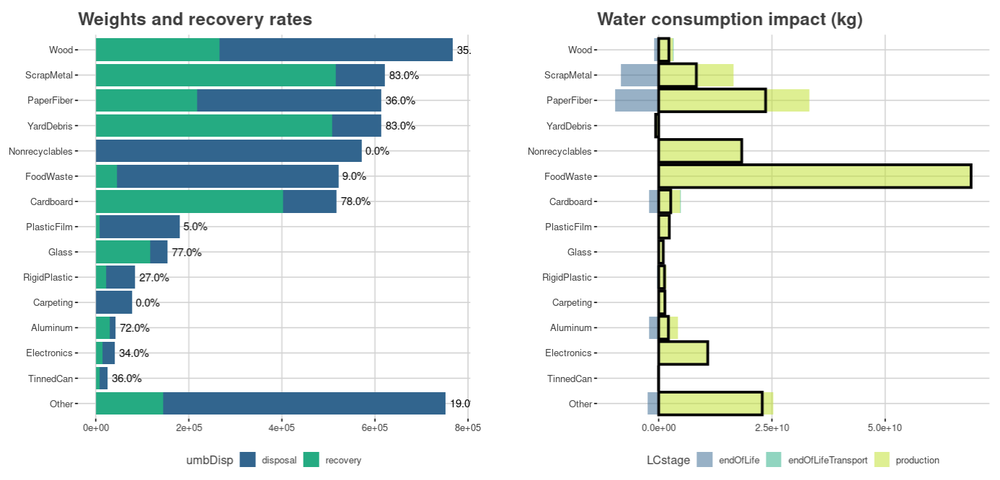

## The Waste Impact Calculator project and its repositories

The Waste Impact Calculator (WIC) is a framework for estimating the life cycle environmental impacts associated with solid waste materials and treatments, and projecting the impact consequences of solid waste management decisions (e.g. comparing waste prevention to recycling).  While it was created with the needs of the Oregon Department of Environmental Quality in mind, it should be relevant to many other parties interested in materials, waste, and waste management.

* For a video introduction, see [this talk for the American Center For Life Cycle Assessment](https://youtu.be/Turv-Mpnf4g).
* For a more thorough explication of the rationale and approach behind WIC, see the *[Technical Overview of the Waste Impact Calculator](https://github.com/OR-Dept-Environmental-Quality/wic-base/blob/main/documentation/technical-overview-of-the-wic.pdf)*.
* Disambiguation: for information on the Women Infants and Children supplemental nutrition program, also abbreviated WIC, see [this page](https://www.oregon.gov/oha/ph/healthypeoplefamilies/wic/Pages/index.aspx).

WIC may be expressed in many ways.  At the most basic level it helps you contrast the weight and impacts of materials, for example:

But really, the sky's the limit.  See *[Example applications of the Waste Impact Calculator](https://github.com/OR-Dept-Environmental-Quality/wic-base/blob/main/documentation/example-applications-of-the-wic.pdf)* for a few more ideas.

### WIC repositories

WIC project work occurs in several repos, listed below. Some of these are still works in progress.  Official releases will (eventually) be available for download within each repo.

* [wic-data](https://github.com/OR-Dept-Environmental-Quality/wic-data) -- Most users will be interested in this.  The repo contains an installable R package containing impact factors and example datasets for using the Waste Impact Calculator framework. Help files contain links to documentation, including worked examples.
* [wic-base](https://github.com/OR-Dept-Environmental-Quality/wic-base) -- The fundamental data and processing behind the material in *wic-data*.  Includes detailed documentation on life cycle impact modeling for individual materials.
* wic-wastesheds -- calculation of life cycle impacts for solid waste in Oregon, Oregon's counties, and the United States as a whole, under 3 management scenarios related for recycling rates.
* wic-app -- a shiny app for viewing the results produced by wic-wastesheds
* wic-eyo -- a shiny app allowing the user to enter their own data, and produce results similar to those produced by wic-app.

### Technical review

The life cycle impact modeling work for WIC releases tagged 1.0 was reviewed by an independent technical authority, Dr. Christoph Koffler of [Sphera](https://sphera.com/).  The reviewer's comments can be found in the documentation folder of the [wic-base](https://github.com/OR-Dept-Environmental-Quality/wic-base) repo.  Releases after 1.0 contain new features and data, bug fixes, and improved documentation and examples, so they should not substantially affect the relevance of the reviewer's comments.

### Personal note

While we the authors of WIC ([Martin J. Brown](https://github.com/DEQmbrown2) and [Peter Canepa](https://github.com/DEQpcanepa)) are experienced environmental analysts, and are quite confident in WIC's intellectual foundation, we're new to collaborative coding.  Please apply forbearance to our code/releases/R packages/etc as necessary until we get the hang of this thing.  Your comments and advice, positive or negative, are welcome.  Thanks!
